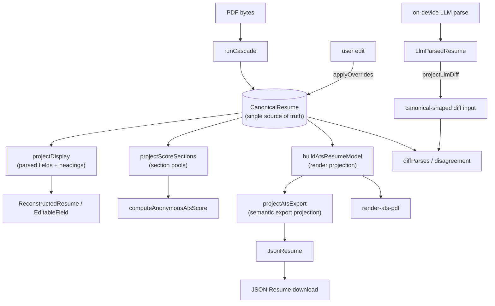

# Canonical résumé model — target representation + staged migration plan (#439)

Design for [#439](https://github.com/offlinecv/OfflineCV/issues/439), the follow-up to the architecture decision in [#438](https://github.com/offlinecv/OfflineCV/issues/438) ("one canonical representation, staged").

**Status:** the design issue itself was docs-only; its implementation stages have since shipped through the combined Stage D+E cutover (#445). Sections 0–3 and 6 describe the current implementation. Section 4 preserves the staged migration as implementation history.

**Implementation baseline:** the current source tree. Source citations are symbol-anchored (`path` → `Symbol`) rather than line-anchored, except where a historical line reference is itself the subject. This avoids line drift while preserving an unambiguous source lookup. `ATS_SCORE_ALGO_VERSION` is currently `"1.7"` (`src/lib/score/score.ts` → `ATS_SCORE_ALGO_VERSION`); the persisted-cache key composes it with `CANONICAL_SHAPE_VERSION` (§6).

---

## 0. The thesis and current outcome

The original design identified five peer shapes for the same underlying résumé. That is no longer the current architecture: `CanonicalResume` is now the single parse core, while the remaining shapes are boundary DTOs or one-way projections.

| Shape | Home | Current role |
|---|---|---|
| `CanonicalResume` | `heuristics/canonical.ts` → `CanonicalResume` | single parse core: `fields`, `sections`, and `fieldConfidence` |
| `HeuristicParsedResume` | `heuristics/types.ts` → `HeuristicParsedResume` | field core held at `CanonicalResume.fields` |
| `SectionedResume` | `heuristics/line-model.ts` → `SectionedResume` | section-membership core held at `CanonicalResume.sections` |
| `CascadeResult` | `heuristics/types.ts` → `CascadeResult` | cascade envelope with one `canonical` member plus extraction/layout metadata; no top-level `parsed`/`sections`/`fieldConfidence` façade |
| `LlmParsedResume` | `webllm/parse-resume.ts` → `LlmParsedResume` | on-device LLM boundary DTO; `projectLlmDiff` owns the field-name mapping into a canonical-shaped diff input |
| `AtsResumeModel` / `JsonResume` | `pdf/ats-resume-model.ts` → `AtsResumeModel`; `pdf/to-json-resume.ts` → `JsonResume` | one-way render/export projections; neither is synchronized back into the parse core |

The decision in #438 was to collapse the peer shapes toward **one canonical internal model** with thin display, score, render/export, JSON-Resume, and LLM-diff projections. The combined D+E cutover completed the ownership change; the stage history below records how it stayed green.

The two original structural costs now have different statuses:

- **Cost 1 — peer shapes and hand-sync adapters: resolved.** `ApplyOverridesResult` is already `CanonicalResume & { rawText: string }` (`edit/apply-overrides.ts` → `ApplyOverridesResult`). `projectLlmDiff` (`heuristics/projections.ts` → `projectLlmDiff`) is the single adapter from `LlmParsedResume`; the old “keep field names in sync” contract is gone.
- **Cost 2 — render/parser coupling: still explicit.** `AtsEntry` carries parser-sensitive layout fields such as `headerLineDate`, `subLineDate`, `atomicSegments`, and `headerBold` (`pdf/ats-resume-model.ts` → `AtsEntry`). The canonical core is the source, but the render projection still records the layout cues required by parse→export→parse fidelity.

---

## 1. Current shapes and boundaries (grounded inventory)

### 1 · `CanonicalResume` and its field core
- `CanonicalResume` (`heuristics/canonical.ts` → `CanonicalResume`) owns `fields: HeuristicParsedResume`, `sections: SectionedResume`, and `fieldConfidence: FieldConfidence`.
- `HeuristicParsedResume = Partial<ParsedResume> & { skills; experience; education; phoneIsValid? }` (`heuristics/types.ts` → `HeuristicParsedResume`). `phoneIsValid?` precomputes libphonenumber `isValid()` so the scorer skips importing `libphonenumber-js` on the entry graph.

### 2 · `SectionedResume`
- `SectionedResume` lives in `heuristics/line-model.ts` → `SectionedResume`. It owns `byName`, `accomplishmentSections`, optional `sectionHeadings`, and splitter `source`. `toSectionedResume` (`heuristics/sections.ts` → `toSectionedResume`) builds it from `PdfSection[]`; `projectScoreSections` exposes the scorer's view.

### 3 · `CascadeResult`
- `CascadeResult` (`heuristics/types.ts` → `CascadeResult`) has `canonical: CanonicalResume` plus genuinely additional cascade metadata: `confidence`, layout `triggers`, `suggestedEscalation`, `tiers`, `rawText`, optional `markdown`, `linkAnnotations`, `diagnostics`, and `timings`. It does **not** duplicate `canonical.fields`, `canonical.sections`, or `canonical.fieldConfidence` at top level.

### 4 · `LlmParsedResume`
- `LlmParsedResume` (`webllm/parse-resume.ts` → `LlmParsedResume`) is the strict DTO produced by on-device JSON coercion. `projectLlmDiff(llm)` (`heuristics/projections.ts` → `projectLlmDiff`) maps it once to a `CanonicalResume`-shaped value; `diffParses` consumes canonical inputs. The type is no longer hand-synchronized with `HeuristicParsedResume`.

### 5 · Render and export projections
- `buildAtsResumeModel(result, score)` (`pdf/ats-resume-model.ts` → `buildAtsResumeModel`) reads the canonical core through `projectDisplay` and produces `AtsResumeModel` / `AtsEntry` layout data.
- `toJsonResume(model)` (`pdf/to-json-resume.ts` → `toJsonResume`) is a pure JSON Resume v1.0.0 adapter. It reads the semantic `projectAtsExport(model)` projection (`pdf/ats-export-projection.ts` → `projectAtsExport`), not `AtsEntry` layout fields directly.

### Adapter chain today
```
PDF ─ runCascade ─▶ CascadeResult.canonical ──projectDisplay──▶ AtsResumeModel ──projectAtsExport/toJsonResume──▶ JsonResume
                              │
                              ├── projectScoreSections ──▶ anonymous score
                              ├── applyOverrides ──▶ CanonicalResume + rawText
                              └── diffParses ◀── projectLlmDiff(LlmParsedResume)
```

---

## 2. Implemented canonical representation

### 2.1 The canonical model + projections

One canonical internal shape, `CanonicalResume`, is the **single source of truth**. Other internal views are one-way projections; external/parser-boundary DTOs are mapped into it once and are never synchronized back.



### 2.2 Where the original five shapes landed

| Original shape | Current state | Note |
|---|---|---|
| `HeuristicParsedResume` | `CanonicalResume.fields` | cascade writes the field core once |
| `SectionedResume` | `CanonicalResume.sections` + `projectScoreSections` | section membership is stored once and not re-derived from `rawText` downstream |
| `LlmParsedResume` | boundary DTO mapped by `projectLlmDiff` | the hand-sync note is gone; disagreement compares canonical-shaped inputs |
| `AtsResumeModel` (`AtsEntry` layout fields) | one-way render projection built from the canonical core | parser-sensitive layout cues remain behind this projection boundary; see §3 |
| `JsonResume` | output DTO built through `projectAtsExport` | JSON mapping reads semantic entry fields rather than layout hints |

### 2.3 Where `apply-overrides` lands
`ApplyOverridesResult` is `CanonicalResume & { rawText: string }` (`edit/apply-overrides.ts` → `ApplyOverridesResult`). Edits update the canonical `fields`, `sections`, and `fieldConfidence` members; `rawText` rides alongside because the redacted-date scan still consumes extraction text. There is no separate top-level `parsed`/`sections`/`fieldConfidence` return façade to keep synchronized.

---

## 3. Where the round-trip invariant lives

The canonical field core is the source of truth, but fidelity is enforced across the **canonical-to-render projection and parser**. `buildAtsResumeModel` derives `AtsEntry` values through `projectDisplay`; `AtsEntry` then carries parser-sensitive cues such as `headerLineDate`, `subLineDate`, `atomicSegments`, and `headerBold` (`pdf/ats-resume-model.ts` → `AtsEntry`). `corpus-roundtrip.test.ts` and the focused render round-trip tests pin the resulting parse→export→parse identity.

The parser-side flush-right exemption remains `columnGapCuts` + `isLoneDateRange` (`heuristics/line-assembly.ts` → `columnGapCuts`; `heuristics/line-primitives.ts` → `isLoneDateRange`). Stage C localized reads behind projections; it did not eliminate this deliberate render/parser contract.

---

## 4. Staged migration history

Ordered stages, shipped as **A / B / C / (D+E)** — the final two were combined into one cutover at implementation time (#445; see the Stage D+E entry below). **Each stage keeps `corpus-roundtrip.test.ts`, `render-roundtrip.repro.test.ts`, and the golden snapshots green** — no half-baked intermediate state. Stages A–C were **additive** (the `AtsResumeModel` shape stayed live so in-flight fidelity PRs kept landing); the combined **D+E** is the one-time cutover that removes the `CascadeResult` façade and versions the persisted cache.

### Stage A — Split export-semantics from layout inside `AtsEntry`
Extract `AtsEntryFields` (`ats-resume-model.ts` → `AtsEntryFields`) into a standalone export-semantic projection so `toJsonResume` (`to-json-resume.ts` → `toJsonResume`) reads **semantic** fields, not the render model's layout hints (`headerLineDate`/`subLineDate`/`atomicSegments`/`headerBold`). After this, a layout tweak cannot ripple into export mapping.
- **Round-trip story:** JSON-Resume output byte-identical (the projection reads the same values `AtsEntryFields` already held); corpus + render round-trip untouched (layout fields unmoved). Pure extraction.
- **Blast radius:** `ats-resume-model.ts`, `to-json-resume.ts`, their tests. Small.

### Stage B — Introduce `CanonicalResume`, cascade writes it, projections read it
Define `CanonicalResume` (field core from `HeuristicParsedResume` + section core from `SectionedResume`). `runCascade` populates it alongside `CascadeResult`. Add **display** and **score** projections; point the scorer + `ReconstructedResume` at the projections. `CascadeResult` stays as a compatibility façade over the canonical model.
- **Round-trip story:** score output and golden snapshots unchanged (projections reproduce `sections.byName` pools exactly — assert equality against the current `SectionedResume` in the stage's tests). No render/export change.
- **Blast radius:** new `canonical.ts`, `cascade.ts` wiring, `score.ts` + `ReconstructedResume` read-site swap. Medium.

### Stage C — Move the round-trip invariant onto the canonical model
Make the render+export projection derive from `CanonicalResume` and be round-trip-stable by construction (§3). Renderer draws from the projection; `buildAtsResumeModel` (`ats-resume-model.ts` → `buildAtsResumeModel`) becomes `canonical → render-projection`.
- **Round-trip story:** this is the delicate stage — land it behind the projection with the corpus + render round-trip tests as the gate, and only flip the renderer's source once the projection reproduces every current golden. The `columnGapCuts`/`isLoneDateRange` exemption (`heuristics/line-assembly.ts` → `columnGapCuts`; `heuristics/line-primitives.ts` → `isLoneDateRange`) becomes a canonical-model assertion.
- **Blast radius:** `ats-resume-model.ts`, `render-ats-pdf.ts`, projection module, goldens. Medium-large, but **one-time** — it buys down every future fidelity PR.

### Stage D+E — Collapse the remaining peer shapes + cutover + cache migration (shipped as one, #445)
Stages D and E were combined into a single verifiable cutover (see #445's rationale: an "additive Stage D" would leave the `CascadeResult` façade alive as a crutch, so the projection collapse could never be *proven* complete until the façade itself was gone — one cutover, one round-trip gate, one manual-test cycle). What landed:
- `fieldConfidence` became a **third member of `CanonicalResume`** (`{ fields, sections, fieldConfidence }`) — orthogonal parse-provenance metadata, not a duplicate values shape (see §2.3 note below).
- `LlmParsedResume` stopped being a peer type: on-device LLM output is coerced into a `CanonicalResume` via the **`projectLlmDiff`** projection (`projections.ts`), and `diffParses` (`disagreement.ts`) now takes two `CanonicalResume` shapes and derives its section-presence guard from the heuristic canonical's own `sections.byName` — retiring the caller-computed `presentSections` read in `useResumeAnalysisLlm`. The `parse-resume.ts` hand-sync note is deleted.
- `ApplyOverridesResult` collapsed to `CanonicalResume & { rawText }`: `fields`/`sections`/`fieldConfidence` are the canonical model's own members (no longer a hand-assembled lockstep quadruple); `rawText` rides alongside because it is cascade metadata the scorer's redacted-date scan still reads, not a canonical member.
- The **`CascadeResult` façade is removed**: the type no longer carries a top-level `parsed`/`sections`/`fieldConfidence` triple duplicating the canonical cores. It now holds a single `canonical: CanonicalResume` member alongside the genuinely-additional cascade metadata (`rawText`, `markdown`, `triggers`, `linkAnnotations`, `confidence`, `diagnostics`, `timings`, …) that the canonical model does not own. Every ex-`result.parsed` / `result.sections` / `result.fieldConfidence` read migrated to `result.canonical.{fields,sections,fieldConfidence}` or a projection over `result.canonical`.
- **#321 cache versioning** shipped: the `resumes` IndexedDB snapshot is keyed by `ATS_SCORE_ALGO_VERSION` + a new `CANONICAL_SHAPE_VERSION` (`canonical.ts`). A stale-shape read re-parses from the stored PDF `Blob` rather than deserializing a pre-cutover record into the canonical shape (`resume-library.ts`); a DOCX record with no stored bytes is dropped rather than mis-restored.
- **Round-trip story:** disagreement output, edit re-grade (#133), and `fieldConfidence` (#421) behavior are unchanged — the migration is reference-identical (`result.canonical.fields === the old result.parsed`), so score-algo output and the corpus/render goldens stay byte-identical; the golden *structure* is unaffected because the persisted change is the cache key, not the golden shape. A cache-version-mismatch test asserts old-snapshot-in → re-parse-out.
- **Blast radius:** wide but overwhelmingly mechanical (compiler-enumerated, reference-identical read-site migration across `src/`), plus `parse-resume.ts`, `disagreement.ts`, `projections.ts`, `apply-overrides.ts`, `canonical.ts`, `types.ts`, `resume-library.ts`. This is the one-time cutover.

Per-stage implementation issues were minted from **this** list once it was fixed (§9). D and E were merged at implementation time (#445, superseding #446).

---

## 5. "Typical fidelity change" file-count target

- **Baseline (pre-refactor):** #425/#434/#435 = **40–54 files** per export/parse fidelity change.
- **Target (post-Stage C):** a typical fidelity change touches **≤ 8 files** — the render+export projection (+ its test) and, when the change is semantic, the canonical field it reads (+ test). Regenerated corpus goldens are counted separately (they are generated, not authored) and should shrink because the change is local.
- **How we'll know it worked:** the first fidelity fix that lands *after* Stage C is measured against this bar; if it still sprawls to 40+ files, Stage C didn't dissolve the coupling and the plan is wrong.

---

## 6. Hard constraint — #321 parse-result cache

The `resumes` IndexedDB store caches the **current canonical cascade envelope** in `SavedResumeSnapshot { result: CascadeResult; score; sourceKind; shapeVersion? }` (`resume-library.ts` → `SavedResumeSnapshot`). `result.canonical.sections.byName` survives IndexedDB structured clone as a `Map`; the storage layer continues to treat the parse as opaque.

`CACHE_SHAPE_VERSION` (`resume-library.ts` → `CACHE_SHAPE_VERSION`) composes `ATS_SCORE_ALGO_VERSION` (`score.ts` → `ATS_SCORE_ALGO_VERSION`, currently `"1.7"`) with `CANONICAL_SHAPE_VERSION` (`heuristics/canonical.ts` → `CANONICAL_SHAPE_VERSION`, currently `"2"`). `saveResumeToLibrary` stamps every snapshot. On a mismatch, `loadResumeFromLibrary` re-parses from the stored PDF `Blob`, recomputes the score, and re-stamps the record; if no source bytes exist, it refuses to hydrate the stale shape. A stale record is never silently deserialized as the current canonical model. Refs [#321](https://github.com/offlinecv/OfflineCV/issues/321), [#401](https://github.com/offlinecv/OfflineCV/issues/401).

---

## 7. Hard constraint — header-vs-entry regression case

**#438/#439 were right, and this section's earlier "correction" of them is retracted.** Both issues attribute `lineLooksLikeDatedEntry = hasDateRange(line) || hasDateRange(nextLine)` to `classifyLine`. This section used to answer that neither identifier existed. **Both exist, verbatim and exactly as attributed:** `heuristics/sections.ts` → `classifyLine` computes `const lineLooksLikeDatedEntry = hasDateRange(line) || hasDateRange(nextLine)` and passes it to `isInstitutionRepeat`, over `heuristics/sections.ts` → `hasDateRange`.

The retracted claim was true against the baseline it was written on, and stopped being true on the next parser merge. This doc landed in #440; **#435** (`fix(parser,score): experience field-mapping, section routing, bullet pooling, abbreviated dates`) introduced both identifiers afterwards, and §0 flagged #435 as in flight at the time. So a source claim written in the present tense outlived its baseline by one merge — which is why every citation in this doc is now symbol-anchored (`path` → `Symbol`) rather than line-anchored, and why a *negative* claim about the codebase ("X does not exist") does not belong in a document that is not re-verified on every merge.

A second, adjacent mechanism is also real: the #425 flush-right-date exemption in `heuristics/line-assembly.ts` → `columnGapCuts` (not `sections.ts`, where an earlier revision of this section placed it):

```ts
// src/lib/heuristics/line-assembly.ts → columnGapCuts
if (cuts.length > 0 &&
    isLoneDateRange(mergeItemText(sorted.slice(cuts[cuts.length - 1])))) {
  cuts.pop();   // trailing lone-date segment stays merged into its org text
}
```

The *problem class* named in #438 is real, and the live code makes the case more plainly than the issue did: "is this line a category header or a dated entry?" is decided from **adjacent raw-line signals** — `hasDateRange(nextLine)` reaching forward one raw line in `classifyLine`, and `isLoneDateRange` on the trailing segment in `columnGapCuts` — rather than from a structured field on a canonical model.

**Acceptance test the canonical model must pass:** a one-line `Title  Dates` role under a section header routes as a **dated entry**, not a sub-section boundary, with the header-vs-entry call keyed off a **derived** `isDatedEntry` predicate over the entry's structured dates — not off `isLoneDateRange`/`hasDateRange` re-scanning neighboring raw lines.

> **§7 correction (folded in at Stage C, #444).** Earlier this read "keyed off a structured `isDatedEntry` **property** on `CanonicalResume`." That over-specified: the structure (`start_date` / `end_date` + precision) is **already** on the entry (`fields.experience[]` / `fields.education[]`). A stored `isDatedEntry` field would be a second entries representation parallel to the field core — exactly the parallel-shape lockstep cost this epic removes (considered and **rejected** via `/clarify`, 2026-07-11). So `isDatedEntry` is a **derived predicate** — `Boolean(start_date || end_date)` — over the dates the entry already holds (`isDatedEntry` in `pdf/ats-resume-model.ts`), never a new core or field. It answers §7's coarse "is this a dated entry at all"; the finer flush-right routing (`headerLineDate` / `subLineDate`) stays on `isLoneDateRange` over the *formatted* range, a render-shape concern Stage C keeps byte-identical.

This remains the standing requirement rather than a shipped guarantee: the raw-line reads named above are still live, so the acceptance test above is the bar the header-vs-entry routing is held to, not a property the cutover established. Refs [#438](https://github.com/offlinecv/OfflineCV/issues/438), [#445](https://github.com/offlinecv/OfflineCV/issues/445).

---

## 8. Non-goals

- No parser-heuristic **accuracy** rewrite — this is representation/coupling only (#438).
- No code migration **in #439** — this issue produces the diagram + plan; implementation is the per-stage follow-ups.
- Stages A–C were additive; **in-flight fidelity work (#435 and successors) was not blocked** and migrated at the combined **D+E** cutover (#445), which is the single stage that removes the façade and touches persisted state.

---

## 9. Per-stage follow-up issues to mint (from §4)

Minted **after** this plan is accepted, one per stage, each with its round-trip-invariant story as an explicit acceptance criterion:

1. **Stage A** — extract `AtsEntryFields` export-semantic projection out of `AtsEntry` layout hints. *(smallest; good first cut / intern-sized.)*
2. **Stage B** — introduce `CanonicalResume`; cascade writes it; display + score projections; `CascadeResult` as façade.
3. **Stage C** — move the round-trip invariant onto the canonical model; renderer draws from the projection. *(carries the §7 header-vs-entry acceptance test.)*
4. **Stage D+E** (shipped combined, #445 — supersedes the separate #446) — collapse `LlmParsedResume` + `ApplyOverridesResult` into projections and delete the hand-sync note, **and** cut over: remove the `CascadeResult` façade + ship #321 cache versioning/invalidation (§6). Combined so the façade removal is provable in one round-trip gate rather than two.

Refs [#438](https://github.com/offlinecv/OfflineCV/issues/438), [#321](https://github.com/offlinecv/OfflineCV/issues/321), [#401](https://github.com/offlinecv/OfflineCV/issues/401), [#425](https://github.com/offlinecv/OfflineCV/issues/425), [#434](https://github.com/offlinecv/OfflineCV/issues/434), [#435](https://github.com/offlinecv/OfflineCV/issues/435).

---

## 10. Separator contract

Dogfooding once read a role header as `Role - Subtitle · Company, Location` and asked
whether the ASCII hyphen was a bug or a deliberate parser constraint. It is neither: the
exporter never chooses a hyphen. Every separator `AtsResumeModel` emits is a fixed literal;
the hyphen came from the **role title string itself** — user-authored text, passed through
verbatim.

**The invariant:** the exporter's separator set is fixed and parser-coupled; user text
passes through verbatim and may contain any glyph.

Since #649 the separator BYTES have one owner — `src/lib/resume-format/` — imported by both
the compose site and the split site rather than re-typed at each end. The `Constant` column
names what to import; the `Site` column is where it is applied.

| Join | Separator | Constant | Site |
|---|---|---|---|
| `Title · Company, Location · Team` | `" · "` | `MIDDOT_JOIN` | `resume-format/role-header.ts` → `composeRoleHeader` |
| `Company, Location` | `", "` | `ORG_COMMA` | `resume-format/role-header.ts` → `composeRoleHeader` |
| `Title, Team` (empty-company branch, #466) | `", "` | `ORG_COMMA` | `resume-format/role-header.ts` → `composeRoleHeader` |
| `Institution · Location` | `" · "` | `MIDDOT_JOIN` | `ats-resume-model.ts` → `buildAtsResumeModel` (education mapping) |
| `Degree, Field, Honors, GPA: <grade>` | `", "` | — (literal) | `ats-resume-model.ts` → `buildAtsResumeModel` (education mapping) |
| `Type · Title` (achievement) | `" · "` | `MIDDOT_JOIN` | `ats-resume-model.ts` → `buildAchievementHeader` (compose); `score/entry-dates.ts` → `joinAchievementType` / `splitAchievementType` |
| Compact certifications line | `" · "` | `MIDDOT_JOIN` | `extract/achievements.ts` → `CREDENTIAL_LIST_SEPARATOR` (domain alias) |
| Skills, within a category | `" · "` | `MIDDOT_JOIN` | `ats-resume-model.ts` → `buildAtsResumeModel` (skills mapping) |
| Header ↔ trailing single-token date | `"  "` (two spaces) | `HEADER_DATE_GAP` | `ats-resume-model.ts` → `buildAtsResumeModel` |
| Wrapped-header hanging indent | `12` pt | `HEADER_WRAP_INDENT` | `ats-resume-model.ts` ↔ `entry-blocks.ts` → `isWrappedContinuation` |
| Experience/education date **range** | `" – "` spaced en dash | — (not yet extracted) | `ats-resume-model.ts` → `experienceDateRange` |
| Project/education-fallback date **range** | `"–"` unspaced en dash | — (not yet extracted) | `score/entry-dates.ts` → `buildProjectDates` / `buildEducationDates` |

Every `ats-resume-model.ts` row above is `src/lib/pdf/ats-resume-model.ts`; the date-range
row is `src/lib/score/entry-dates.ts`, a different directory. The two date-range dialects are
deliberately still un-unified — unifying them changes rendered bytes and needs its own
reviewed snapshot sweep (#649 step 3).

The degree/notes comma is left a literal on purpose: it separates a LIST of qualifiers
(degree, field, honors, grade), not an org boundary, so naming it `ORG_COMMA` would assert a
contract that does not hold there.

`resume-format` also owns the SPLIT side of the middot: `MIDDOT` (the bare glyph, matched by
the parser because re-extraction can collapse the spacing) and `MIDDOT_SPLIT_RE` (the
whitespace-bounded boundary). `splitRoleHeader` is the exact inverse of `composeRoleHeader`
and is the executable spec for the grammar — it is deliberately NOT the production parser,
which must read arbitrary third-party résumés and therefore splits on a much wider delimiter
vocabulary (see `heuristics/extract/experience-disambiguate.ts`).

Plus one deliberate exception: an **achievement's** title↔year separator echoes the
*source's own* punctuation (`score/entry-dates.ts` → `achievementYearJoiner`, #380) — a hyphen
there is also user-sourced, by design, so the export re-parses to the same `year_separator`
it came from.

`render-ats-pdf.ts` holds exactly one separator alias of its own —
`MIDDOT_SEGMENT_SEP = MIDDOT_JOIN` (`render-ats-pdf.ts` → `MIDDOT_SEGMENT_SEP`) — used only to keep a
middot-joined segment atomic across a wrap point; it does not choose which fields get
middot-joined, and since #649 it cannot drift from the bytes the model composed.

There is **no** ASCII hyphen anywhere in this set. A `Role - Subtitle` header is a title
field whose value literally contains `" - "`, drawn verbatim.

**Why it's load-bearing, not cosmetic:**

- `composeRoleHeader`'s `MIDDOT_JOIN` is what the re-parser's `mapTitleFirst` splits on to
  recover title / company / location / team.
- The **#466 empty-company branch** exists precisely because swapping one separator changes
  the parse: a naive `"Title · Team"` middot join re-parses as a `Title · Company` shape and
  mislabels the team as the company. The fix emits a **comma** instead (`"Title, Team"`), so
  the parser's role-comma split routes it back to `team`.
- The `", "` in `Company, Location` and the `" · "` before `Team` are load-bearing the same
  way — the comma marks the location boundary, the middot marks the team boundary.
- The two-space header↔date join is also a contract: the wide same-`y` gap is what
  `columnGapCuts` / `flush()` in `sections.ts` read as a flush-right date rail (#425).
- The en dash in a date range feeds `DATE_RANGE_RE` / `isLoneDateRange`
  (`line-primitives.ts`), the shared discriminator between the exporter's flush-right
  decision and the splitter's exemption.

Widening the accepted charset — teaching the exporter to emit `-` or `|` where it emits
`·`, or teaching the parser to treat them as equivalent — changes field routing on real
fixtures. §7 above documents an adjacent tradeoff of this class (the one-line header
removing the title/company structural signal, baselined in `KNOWN_FAILURES`).

**Explicitly out of scope for this contract:**

- Normalizing user-authored hyphens inside a title. `Role - Subtitle` is the user's text;
  rewriting it would be the exporter editing résumé content, which it must never do.
- Widening the parser to accept alternative separators (a source résumé using `|` or `—`
  between title and company parses worse today) — a parser-input question, separate from
  this export-side contract.

Refs [#620](https://github.com/offlinecv/OfflineCV/issues/620), [#466](https://github.com/offlinecv/OfflineCV/issues/466), [#425](https://github.com/offlinecv/OfflineCV/issues/425), [#380](https://github.com/offlinecv/OfflineCV/issues/380).
